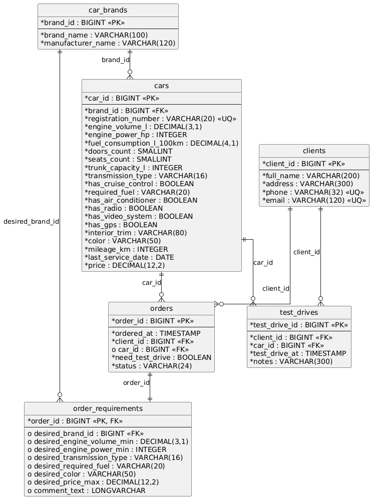

# Информационная система автосалона

Внутреннее приложение менеджера автосалона — система учёта автомобилей, клиентов, заказов и тест-драйвов.

## Содержание

- [Структура проекта](#структура-проекта)
- [Требования](#требования)
- [Быстрый старт](#быстрый-старт)
- [Команды сборки](#команды-сборки)
- [Архитектура Hibernate-слоя](#архитектура-hibernate-слоя)
- [Сценарии использования](#сценарии-использования)
- [Страницы приложения](#страницы-приложения)
- [Схема навигации](#схема-навигации)
- [Схема базы данных](#схема-базы-данных)
- [Отображение таблиц БД на страницы](#отображение-таблиц-бд-на-страницы)

---

## Структура проекта

```
.
├── build.xml                # Ant-файл сборки
├── ivy.xml                  # Описание зависимостей (Ivy)
├── db/
│   ├── schema.sql           # DDL-скрипт создания структуры БД
│   ├── seed.sql             # Скрипт заполнения БД тестовыми данными
│   └── schema.puml          # PlantUML-диаграмма схемы БД
├── src/
│   ├── main/
│   │   ├── java/ru/msu/cmc/webprac/
│   │   │   ├── entities/    # Hibernate-сущности (CarBrand, Car, Client, Order, ...)
│   │   │   ├── enums/       # Перечисления (TransmissionType, OrderStatus)
│   │   │   ├── dao/         # DAO-интерфейсы
│   │   │   │   └── impl/    # DAO-реализации
│   │   │   └── utils/       # HibernateUtil
│   │   └── resources/
│   │       ├── hibernate.cfg.xml
│   │       └── logback.xml
│   └── test/
│       ├── java/ru/msu/cmc/webprac/dao/   # TestNG-тесты
│       └── resources/
│           ├── hibernate-test.cfg.xml
│           └── testng.xml
├── docs/
│   └── db-schema.png        # Визуализация диаграммы
└── README.md
```

## Требования

| Компонент       | Версия           |
|-----------------|------------------|
| Java            | 8+               |
| Apache Ant      | 1.9+             |
| Apache Ivy      | 2.5+             |
| HSQLDB          | 2.7+ (скачивается автоматически через Ivy) |
| Hibernate       | 5.6 (скачивается автоматически через Ivy) |
| TestNG          | 7.8 (скачивается автоматически через Ivy) |

## Быстрый старт

```bash
# Скачать все зависимости
ant resolve

# Скомпилировать проект
ant compile

# Создать БД и заполнить тестовыми данными
ant init-db

# Запустить тесты
ant test

# Просмотреть содержимое всех таблиц
ant show-db
```

## Команды сборки

| Команда              | Описание |
|----------------------|----------|
| `ant help`           | Показать список доступных задач |
| `ant resolve`        | Скачать зависимости через Ivy |
| `ant compile`        | Скомпилировать исходный код |
| `ant compile-tests`  | Скомпилировать тесты |
| `ant test`           | Запустить TestNG-тесты |
| `ant create-db`      | Создать структуру БД (выполнить `schema.sql`) |
| `ant init-db`        | Создать структуру **и** заполнить тестовыми данными (`seed.sql`) |
| `ant show-db`        | Вывести содержимое всех таблиц |
| `ant clear-db`       | Удалить файлы БД с диска |
| `ant reset-db`       | Полностью пересоздать БД и заполнить её |
| `ant clean`          | Удалить каталог сборки |
| `ant clean-all`      | Удалить сборку и БД |

БД создаётся в каталоге `data/` в формате HSQLDB (file-mode); при остановке данные автоматически сбрасываются на диск (`shutdown=true`).
Тесты используют in-memory БД (`jdbc:hsqldb:mem:testdb`) с автоматическим созданием схемы (`hbm2ddl.auto=create`).

---

## Архитектура Hibernate-слоя

### Entity-классы (хранимые объекты)

Все сущности расположены в пакете `ru.msu.cmc.webprac.entities` и аннотированы стандартными JPA-аннотациями.

| Класс | Таблица | Ключевые связи |
|-------|---------|----------------|
| `CarBrand` | `car_brands` | `1 → N` с `Car` |
| `Car` | `cars` | `N → 1` с `CarBrand`, `1 → N` с `TestDrive` |
| `Client` | `clients` | `1 → N` с `Order`, `1 → N` с `TestDrive` |
| `Order` | `orders` | `N → 1` с `Client`, `N → 1` с `Car`, `1 → 1` с `OrderRequirement` |
| `OrderRequirement` | `order_requirements` | `1 → 1` с `Order` (shared PK через `@MapsId`), `N → 1` с `CarBrand` |
| `TestDrive` | `test_drives` | `N → 1` с `Client`, `N → 1` с `Car` |

Перечисления: `TransmissionType` (`AT`, `MT`, `CVT`, `AMT`), `OrderStatus` (`IN_PROGRESS`, `WAITING_SUPPLY`, `IN_SHOWROOM`, `TEST_DRIVE`, `COMPLETED`).

### DAO-классы (служебные классы)

Интерфейсы и реализации в `ru.msu.cmc.webprac.dao` / `dao.impl`.

| Интерфейс | Методы с нетривиальной логикой |
|-----------|-------------------------------|
| `CarBrandDAO` | `getByName(name)`, `getByManufacturer(name)` — поиск марки по названию |
| `CarDAO` | `getByRegistrationNumber(num)`, `getByBrand(brand)`, `getByFilter(filter)` — фильтрация по цене, КПП, цвету, мощности и т.д. |
| `ClientDAO` | `getByPhone(phone)`, `getByEmail(email)`, `getByName(part)`, `getClientsByOrderStatus(status)` |
| `OrderDAO` | `getByClient(client)`, `getByCar(car)`, `getByStatus(status)`, `updateStatus(id, status)` |
| `TestDriveDAO` | `getByClient(client)`, `getByCar(car)`, `getByClientAndCar(client, car)` |

Все наследуют `GenericDAO<T>` с базовыми CRUD-методами: `getById`, `getAll`, `save`, `update`, `delete`, `deleteById`.

### Тесты

TestNG-тесты расположены в `src/test/java`. Для каждого DAO-класса свой тестовый класс.
Тесты работают с in-memory HSQLDB (`hibernate-test.cfg.xml`).
Покрытие — все нетривиальные методы; для поисковых методов проверяются оба сценария: «найдено» и «не найдено».

---

## Сценарии использования

### 1. Поиск и просмотр автомобилей

1. Пользователь открывает главную страницу и переходит в раздел **Автомобили**.
2. На странице списка задаёт фильтры: марка/производитель, рег. номер, цена, двигатель (объём, мощность, расход), кол-во дверей/мест, багажник, КПП, топливо, круиз-контроль, встроенные устройства, обивка, цвет, пробег, дата ТО.
3. Система выводит список подходящих автомобилей.
4. Пользователь открывает **карточку автомобиля** — полные характеристики, цена, список клиентов, проходивших тест-драйв.

### 2. Добавление, редактирование и удаление автомобиля

1. На странице списка — кнопка **«Добавить автомобиль»** → форма ввода.
2. Заполняются рег. номер, марка, все характеристики, цена.
3. Система сохраняет запись и возвращает к списку или карточке.
4. Редактирование — через карточку → **«Редактировать»** → изменение полей → сохранение.
5. Удаление — **«Удалить»** в карточке или списке с подтверждением.

### 3. Управление марками автомобилей

1. Раздел **«Марки автомобилей»** — список марок и производителей.
2. Добавление, редактирование, удаление марки.
3. При выборе марки — переход к списку автомобилей с предустановленным фильтром.

### 4. Поиск и просмотр клиентов

1. Раздел **«Клиенты»** — поиск по ФИО, телефону, e-mail.
2. Фильтрация по параметрам заказов: статус, дата, необходимость тест-драйва, привязанный автомобиль, требования к автомобилю из заказа.
3. Выбор клиента → **карточка клиента**: контактные данные + история заказов.

### 5. Добавление, редактирование и удаление клиента

1. Кнопка **«Добавить клиента»** → форма: ФИО, адрес, телефон, e-mail.
2. Сохранение → карточка клиента.
3. Редактирование контактных данных через форму.
4. Удаление с подтверждением.

### 6. Оформление нового заказа

1. Создание из списка заказов, карточки клиента или карточки автомобиля.
2. Форма заказа: выбор клиента, конкретный автомобиль **или** требования (марка, мощность, КПП, цвет, макс. цена).
3. Отметка, нужен ли тест-драйв.
4. Заказ создаётся со статусом `IN_PROGRESS`, требования сохраняются в отдельной записи.

### 7. Просмотр заказа и изменение статуса

1. Раздел **«Заказы»** — таблица: дата/время, клиент, автомобиль/требования, тест-драйв, статус.
2. Открытие карточки заказа → просмотр деталей.
3. Смена статуса: `IN_PROGRESS` → `WAITING_SUPPLY` → `IN_SHOWROOM` → `TEST_DRIVE` → `COMPLETED`.

### 8. Фиксация тест-драйва

1. Заказ переводится в статус `TEST_DRIVE`.
2. Менеджер фиксирует тест-драйв для пары «клиент — автомобиль».
3. Создаётся запись в журнале `test_drives` (дата, время, комментарий).
4. Запись доступна в карточке автомобиля и карточке клиента.

---

## Страницы приложения

### Главная страница

| | |
|---|---|
| **Данные** | Сводка: количество автомобилей, клиентов, заказов; меню разделов. |
| **Действия** | Переход в «Автомобили», «Марки», «Клиенты», «Заказы». |

### Список автомобилей

| | |
|---|---|
| **Данные** | Таблица: марка, производитель, рег. номер, цена, пробег; панель фильтров. |
| **Действия** | Поиск/фильтрация, сортировка (цена, пробег, мощность, объём двигателя, расход, дата ТО, марка, рег. номер), открытие карточки, создание автомобиля. |

### Карточка автомобиля

| | |
|---|---|
| **Данные** | Полные характеристики, цена, дата ТО, список тест-драйвов. |
| **Действия** | Редактирование, удаление, оформление заказа, фиксация тест-драйва, переход в карточку клиента. |

### Форма автомобиля

| | |
|---|---|
| **Данные** | Поля ввода: марка, рег. номер, двигатель, КПП, оборудование, цвет, пробег, цена. |
| **Действия** | Сохранение, отмена. |

### Список марок автомобилей

| | |
|---|---|
| **Данные** | Таблица марок и производителей. |
| **Действия** | Добавление, редактирование, удаление марки; переход к автомобилям с фильтром по марке. |

### Форма марки

| | |
|---|---|
| **Данные** | Название марки, производитель. |
| **Действия** | Сохранение, отмена. |

### Список клиентов

| | |
|---|---|
| **Данные** | Таблица: ФИО, телефон, e-mail, кол-во заказов; фильтры по параметрам заказов. |
| **Действия** | Поиск (ФИО, телефон, e-mail), фильтрация по заказам, открытие карточки, добавление клиента. |

### Карточка клиента

| | |
|---|---|
| **Данные** | ФИО, адрес, телефон, e-mail, список заказов, история тест-драйвов. |
| **Действия** | Редактирование, удаление, создание заказа, переход в карточку заказа. |

### Форма клиента

| | |
|---|---|
| **Данные** | Поля: ФИО, адрес, телефон, e-mail. |
| **Действия** | Сохранение, отмена. |

### Список заказов

| | |
|---|---|
| **Данные** | Таблица: дата/время, клиент, автомобиль/требования, тест-драйв, статус; панель фильтров. |
| **Действия** | Поиск/фильтрация, открытие карточки заказа, создание заказа. |

### Карточка заказа

| | |
|---|---|
| **Данные** | Дата/время, клиент, автомобиль или требования, need_test_drive, статус. |
| **Действия** | Смена статуса, переход в карточку клиента/автомобиля, фиксация тест-драйва. |

### Форма заказа

| | |
|---|---|
| **Данные** | Выбор клиента, выбор автомобиля или ввод требований, отметка тест-драйва, начальный статус. |
| **Действия** | Сохранение, отмена. |

---

## Схема навигации

```
                        ┌─────────────────┐
                        │  Главная стр.   │
                        └──┬──┬──┬──┬─────┘
                           │  │  │  │
          ┌────────────────┘  │  │  └────────────────┐
          ▼                   ▼  ▼                   ▼
 ┌──────────────┐  ┌──────────┐ ┌──────────┐  ┌──────────┐
 │  Список      │  │  Список  │ │  Список  │  │  Список  │
 │  автомобилей │  │  марок   │ │ клиентов │  │  заказов │
 └──┬───────┬───┘  └──┬───┬───┘ └──┬───┬───┘  └──┬───┬───┘
    │       │         │   │        │   │          │   │
    ▼       ▼         ▼   │        ▼   ▼          ▼   ▼
 Карточка  Форма   Форма  │     Карточка Форма  Карточка Форма
 авто      авто    марки  │     клиента  клиента заказа  заказа
    │                     │        │                │
    ├── Форма заказа      │        ├── Форма заказа │
    ├── Карточка клиента  │        ├── Карточка     │
    │                     │        │   заказа       │
    │                     │        │                ├── Карточка клиента
    │                     └────────┼────────────────├── Карточка авто
    │  (список авто с фильтром)    │                │
    └──────────────────────────────┘
```

Главная страница — центральная точка входа. Карточки сущностей обеспечивают переход к операциям редактирования и к связанным объектам.

---

## Схема базы данных



Источник диаграммы: [`db/schema.puml`](db/schema.puml).

БД состоит из **6 таблиц**. Ниже — описание каждой.

### `car_brands` — марки автомобилей

| Поле | Тип | Описание |
|------|-----|----------|
| `brand_id` | BIGINT, PK | Первичный ключ |
| `brand_name` | VARCHAR(100) | Наименование марки |
| `manufacturer_name` | VARCHAR(120) | Юридическое/общепринятое наименование производителя |

Уникальность: пара (`brand_name`, `manufacturer_name`).

### `cars` — автомобили

| Поле | Тип | Описание |
|------|-----|----------|
| `car_id` | BIGINT, PK | Первичный ключ |
| `brand_id` | BIGINT, FK → `car_brands` | Ссылка на марку |
| `registration_number` | VARCHAR(20), UQ | Регистрационный номер |
| `engine_volume_l` | DECIMAL(3,1) | Объём двигателя, л |
| `engine_power_hp` | INTEGER | Мощность двигателя, л.с. |
| `fuel_consumption_l_100km` | DECIMAL(4,1) | Расход топлива, л/100 км |
| `doors_count` | SMALLINT | Количество дверей |
| `seats_count` | SMALLINT | Количество мест |
| `trunk_capacity_l` | INTEGER | Объём багажника, л |
| `transmission_type` | VARCHAR(16) | Тип КПП: `AT`, `MT`, `CVT`, `AMT` |
| `has_cruise_control` | BOOLEAN | Круиз-контроль |
| `required_fuel` | VARCHAR(20) | Требуемое топливо (АИ-92, АИ-95, АИ-98, ДТ и т.д.) |
| `has_air_conditioner` | BOOLEAN | Кондиционер |
| `has_radio` | BOOLEAN | Радио |
| `has_video_system` | BOOLEAN | Видеосистема |
| `has_gps` | BOOLEAN | GPS-навигатор |
| `interior_trim` | VARCHAR(80) | Обивка салона (ткань, кожа, алькантара и т.д.) |
| `color` | VARCHAR(50) | Цвет кузова |
| `mileage_km` | INTEGER | Пробег, км |
| `last_service_date` | DATE | Дата последнего ТО |
| `price` | DECIMAL(12,2) | Цена, ₽ |

Ограничения: `transmission_type IN ('AT','MT','CVT','AMT')`, `price >= 0`, `mileage_km >= 0`.

### `clients` — клиенты

| Поле | Тип | Описание |
|------|-----|----------|
| `client_id` | BIGINT, PK | Первичный ключ |
| `full_name` | VARCHAR(200) | ФИО |
| `address` | VARCHAR(300) | Почтовый адрес |
| `phone` | VARCHAR(32), UQ | Телефон |
| `email` | VARCHAR(120), UQ | E-mail |

### `orders` — заказы

| Поле | Тип | Описание |
|------|-----|----------|
| `order_id` | BIGINT, PK | Первичный ключ |
| `ordered_at` | TIMESTAMP | Дата и время оформления |
| `client_id` | BIGINT, FK → `clients` | Клиент |
| `car_id` | BIGINT, FK → `cars`, nullable | Конкретный автомобиль (NULL — заказ только по требованиям) |
| `need_test_drive` | BOOLEAN | Требуется ли тест-драйв |
| `status` | VARCHAR(24) | Статус заказа |

Допустимые значения `status`:

| Код | Значение |
|-----|----------|
| `IN_PROGRESS` | В обработке |
| `WAITING_SUPPLY` | Ожидание поставки |
| `IN_SHOWROOM` | Есть в салоне |
| `TEST_DRIVE` | На тест-драйве |
| `COMPLETED` | Выполнен |

### `order_requirements` — требования к автомобилю в заказе

| Поле | Тип | Описание |
|------|-----|----------|
| `order_id` | BIGINT, PK + FK → `orders` | Связь 1:1 с заказом |
| `desired_brand_id` | BIGINT, FK → `car_brands` | Желаемая марка |
| `desired_engine_volume_min` | DECIMAL(3,1) | Мин. объём двигателя |
| `desired_engine_power_min` | INTEGER | Мин. мощность |
| `desired_transmission_type` | VARCHAR(16) | Желаемый тип КПП |
| `desired_required_fuel` | VARCHAR(20) | Желаемое топливо |
| `desired_color` | VARCHAR(50) | Желаемый цвет |
| `desired_price_max` | DECIMAL(12,2) | Верхняя граница бюджета |
| `comment_text` | LONGVARCHAR | Текстовое уточнение |

При удалении заказа запись требований удаляется каскадно (`ON DELETE CASCADE`).

### `test_drives` — журнал тест-драйвов

| Поле | Тип | Описание |
|------|-----|----------|
| `test_drive_id` | BIGINT, PK | Первичный ключ |
| `client_id` | BIGINT, FK → `clients` | Клиент |
| `car_id` | BIGINT, FK → `cars` | Автомобиль |
| `test_drive_at` | TIMESTAMP | Дата и время тест-драйва |
| `notes` | VARCHAR(300) | Комментарий менеджера |

Уникальность: тройка (`client_id`, `car_id`, `test_drive_at`).

### Связи между таблицами

```
car_brands  1 ──── N  cars
car_brands  1 ──── N  order_requirements
clients     1 ──── N  orders
cars        1 ──── N  orders
orders      1 ──── 1  order_requirements
clients     1 ──── N  test_drives
cars        1 ──── N  test_drives
```

### Индексы

Индексы созданы по часто используемым полям фильтрации и поиска:

- `cars`: `brand_id`, `price`, `color`
- `clients`: `full_name`
- `orders`: `client_id`, `car_id`, `status`, `ordered_at`
- `order_requirements`: `desired_brand_id`
- `test_drives`: `client_id`, `car_id`

---

## Отображение таблиц БД на страницы

| Страница | Таблицы | Назначение |
|----------|---------|------------|
| Главная | `cars`, `clients`, `orders` | Сводные показатели, кол-во заказов по статусам |
| Список автомобилей | `cars` + `car_brands` | Поиск, фильтрация, краткая информация |
| Карточка автомобиля | `cars` + `car_brands` + `test_drives` + `clients` | Полные данные и история тест-драйвов |
| Список клиентов | `clients` + `orders` + `order_requirements` | Поиск клиентов, фильтры по заказам |
| Карточка клиента | `clients` + `orders` + `order_requirements` + `cars` | Контакты и история заказов |
| Список заказов | `orders` + `clients` + `cars` + `order_requirements` | Список заказов с фильтрацией |
| Карточка заказа | `orders` + `clients` + `cars` + `order_requirements` | Детали заказа, смена статуса |
